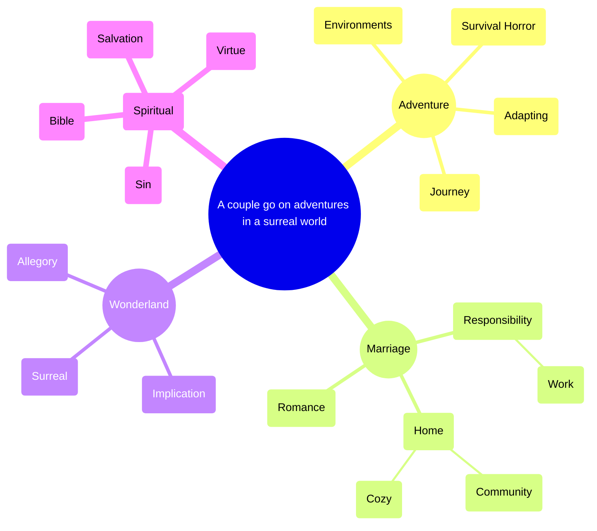

# Premise

A husband and wife go on adventures in a surreal world.

# Primary theme

[Peace in the eye of the storm](http://127.0.0.1:5173/?node=4e21b1585595437d834a897e603fb87a).

# Plot

 

[TWOLD scenes by part](http://127.0.0.1:5173/?node=151ff4ab3b77406ead435ee39666705c)

# Current focus

# Mind map

* [Wonderland](http://127.0.0.1:5173/?node=3cbc40d2ba2a4c76b4b9dc370452fcfe)

* [Biblical](http://127.0.0.1:5173/?node=bdacc489959e4e39b8e3a86c7dede268)

* [A wholesome marriage is beautiful](http://127.0.0.1:5173/?node=729f8c8cb3774419a3611b8961a5da02)

* [Responsibility](http://127.0.0.1:5173/?node=23358e628ba280ca9e79ebeaa0fa931b)

* [Adventure](http://127.0.0.1:5173/?node=1d458e628ba28026830dfe3db74cba19)

* [Cozy horror](marloth:e5cc80dc61ed4c629951cdf472b20b7a)

# Site structure

[Site structure](http://127.0.0.1:5173/?node=36358e628ba280c3b07ef49b3e3bf7e8)

# Opposing dimensions

[Untitled](http://127.0.0.1:5173/?node=1d458e628ba2803e8047c5ce5813ff83)

# Setting

[TWOLD setting](http://127.0.0.1:5173/?node=2a458e628ba280b2a9d4eec45cf051c2)
