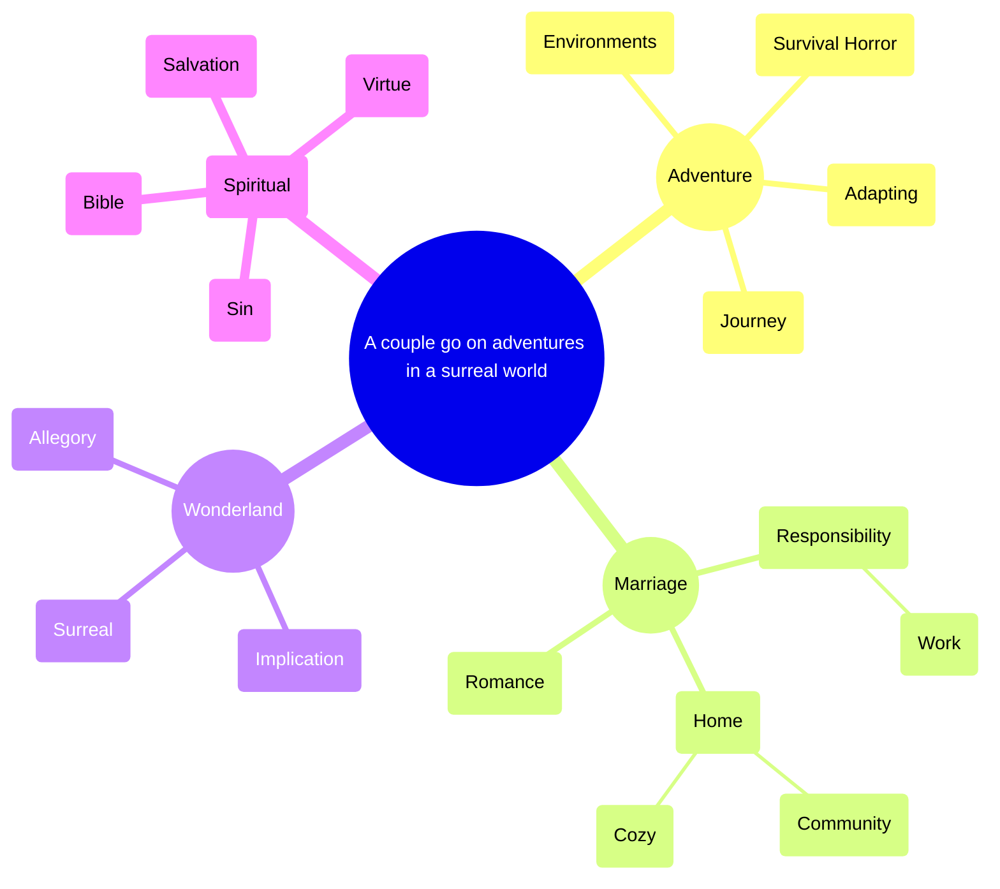

# Premise

A husband and wife go on adventures in a surreal world.

# Primary theme

[Peace in the eye of the storm](http://127.0.0.1:5173/?record=4e21b1585595437d834a897e603fb87a).

# Plot

 

[TWOLD scenes by part](http://127.0.0.1:5173/?record=151ff4ab3b77406ead435ee39666705c)

# Current focus

# Mind map

* [Wonderland](http://127.0.0.1:5173/?record=3cbc40d2ba2a4c76b4b9dc370452fcfe)

  * [Explicit vs. Allegory](http://127.0.0.1:5173/?record=1d458e628ba2803985e2c08ee8c8f846)

  * Implicit

  * [Surreal](http://127.0.0.1:5173/?record=cee6644b68094859bf1b17c5e7fd25de)

* Spiritual

  * Sin

  * [Depictions of virtue](http://127.0.0.1:5173/?record=d3f3b663de9446b0aff4183df49926e3)

  * Salvation

  * [Biblical](http://127.0.0.1:5173/?record=bdacc489959e4e39b8e3a86c7dede268)

* [A wholesome marriage is beautiful](http://127.0.0.1:5173/?record=729f8c8cb3774419a3611b8961a5da02)

  * [Responsibility](http://127.0.0.1:5173/?record=23358e628ba280ca9e79ebeaa0fa931b)

    * [James’ job](http://127.0.0.1:5173/?record=1e3a028f3cd8477ba69306ef8654f553)

  * Romance

  * Home

    * [Cozy](http://127.0.0.1:5173/?record=27e58e628ba280a889b9d93e442abcb8)

    * [Community](http://127.0.0.1:5173/?record=c80ee480543c42eda65e330b6d1c6d9b)

* [Adventure](http://127.0.0.1:5173/?record=1d458e628ba28026830dfe3db74cba19)

  * [Free spirited / adaptable main characters](http://127.0.0.1:5173/?record=1d458e628ba2803d9f73cd30fd59b6ef)

  * [Survival horror](http://127.0.0.1:5173/?record=dc101b6438cf43a8b5f1e17212b8c950)

  * Environments

  * [Stability vs. Journey](http://127.0.0.1:5173/?record=d03e09bc477b4ef0be148b5e7071d406)

# Site structure

[Site structure](http://127.0.0.1:5173/?record=36358e628ba280c3b07ef49b3e3bf7e8)

# Opposing dimensions

[Untitled](http://127.0.0.1:5173/?record=1d458e628ba2803e8047c5ce5813ff83)

# Setting

[TWOLD setting](http://127.0.0.1:5173/?record=2a458e628ba280b2a9d4eec45cf051c2)
