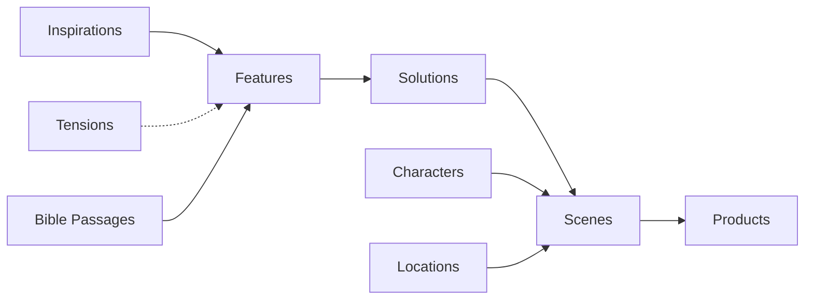
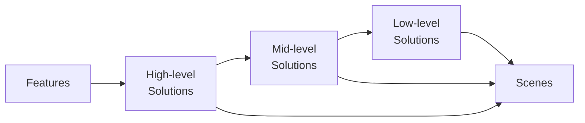

---
labels:
  - NotionPage
title: Site structure
notion_id: 36358e628ba280c3b07ef49b3e3bf7e8
source_export: exports/e1871eda-1585-4e95-9781-1add0033d51f_ExportBlock-7929816c-16af-4229-9d56-b036ede8360e.zip/Marloth/TWOLD design/Site structure 36358e628ba280c3b07ef49b3e3bf7e8.md
alias: Site structure
inferred_notion_path: Marloth/TWOLD design
created_at: 2026-05-17T01:43:00.000Z
modified_at: 2026-05-17T02:13:00.000Z
notion_url: https://www.notion.so/Site-structure-36358e628ba280c3b07ef49b3e3bf7e8
notion_archived: false
---
# Site structure

# Primary data flow

[TWOLD inspirations](../Inspirations/Inspirations%202eea538996934ce8abafc27132e576c1.md) → [Requirements](../Features%20dd0de9867cc345b898929306bdf9fc83.md) → [Features](../Solutions%20528384943746443a9c89699b57e3bbec.md) → [TWOLD Scenes database](../Scenes%20204dba198db74611b0b49a98dd53e8f5.md) → 

# Schema

# Inspirations and features

It is important to distill inspirations into features and avoid directly applying inspirations to story content.

Inspirations are complex ideas.

Every inspiration has elements that don’t fit in Marloth, be they noise, distractions, out-of-scope, or bad.

# Features and solutions

I’ve vacillated back and forth in how to structure the nested layers of content elements and motivation.

I’ve mostly settled on the following structure.

Features are mostly flat (though I have some residue of nested features).

Solutions have N* depth.

Features are intended to be high-level
