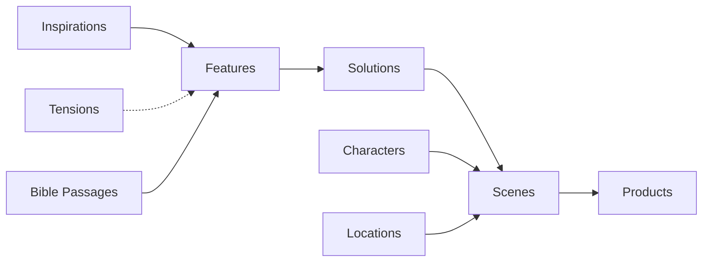
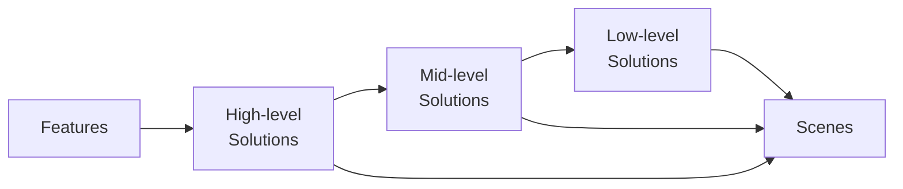

# Site structure

# Primary data flow

[TWOLD inspirations](./01KWN86X6NJZMP5ZESZTNDXXW0.md) → [Requirements](./01KWN86X6NJZMP5ZESZTNDXY7W.md) → [Features](./01KWN86X6NJZMP5ZESZTNDXXYZ.md) → [TWOLD Scenes database](./01KWN86X6MFZQAJ1V36T9592EA.md) → 

# Schema

# Inspirations and features

It is important to distill inspirations into features and avoid directly applying inspirations to story content.

Inspirations are complex ideas.

Every inspiration has elements that don’t fit in Marloth, be they noise, distractions, out-of-scope, or bad.

# Features and solutions

I’ve vacillated back and forth in how to structure the nested layers of content elements and motivation.

I’ve mostly settled on the following structure.

Features are mostly flat (though I have some residue of nested features).

Solutions have N* depth.

Features are intended to be high-level
