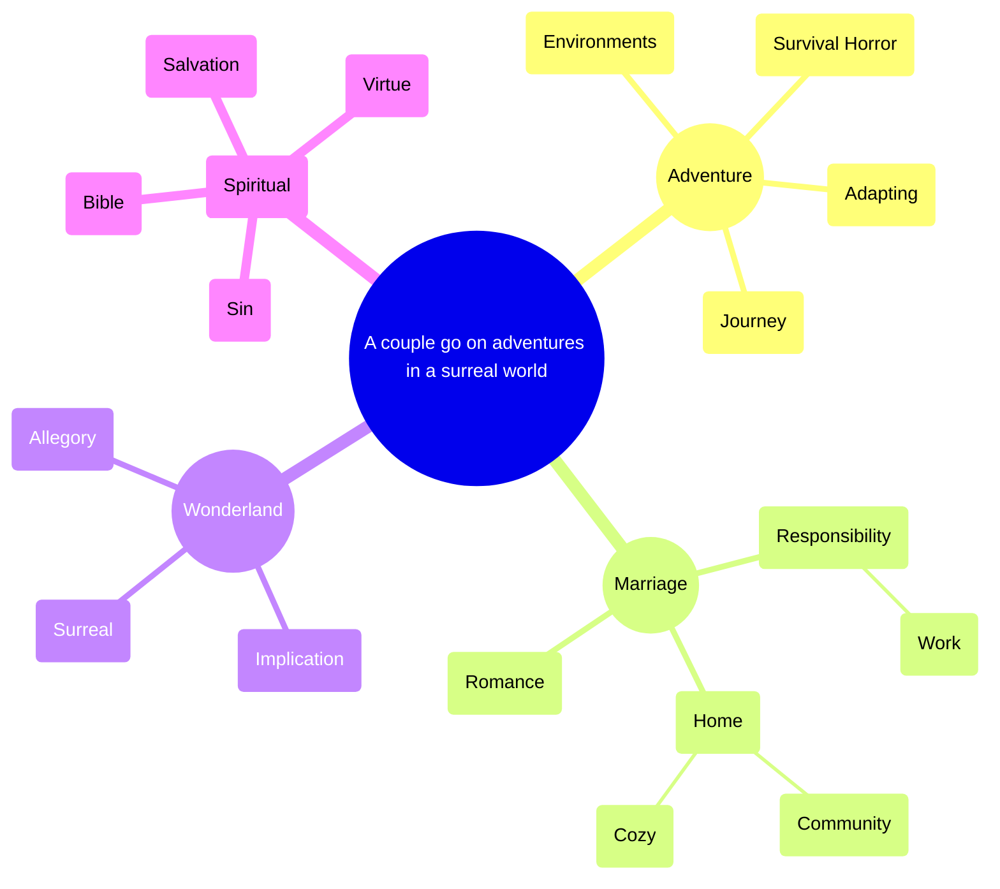

# Premise

A husband and wife go on adventures in a surreal world.

# Primary theme

[[4e21b1585595437d834a897e603fb87a]].

# Plot

 

[[151ff4ab3b77406ead435ee39666705c]]

# Current focus

# Mind map

* [[3cbc40d2ba2a4c76b4b9dc370452fcfe]]

* [[bdacc489959e4e39b8e3a86c7dede268]]

* [[729f8c8cb3774419a3611b8961a5da02]]

* [[23358e628ba280ca9e79ebeaa0fa931b]]

* [[1d458e628ba28026830dfe3db74cba19]]

* [[e5cc80dc61ed4c629951cdf472b20b7a]]

# Site structure

[[36358e628ba280c3b07ef49b3e3bf7e8]]

# Opposing dimensions

[[1d458e628ba2803e8047c5ce5813ff83]]

# Setting

[[2a458e628ba280b2a9d4eec45cf051c2]]
