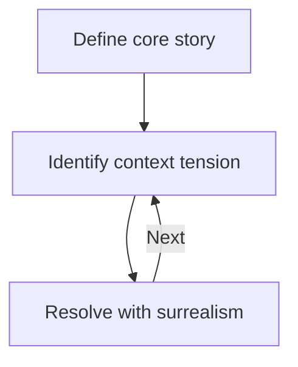

# Applied surrealism

# Overview

This document describes how to apply [Surreal](../Surreal%20cee6644b68094859bf1b17c5e7fd25de.md)ism within Marloth narratives.

# The role of surrealism

For the Marloth recipe, surrealism is essential but not fundamental.

Surrealism is a surface layer.

# Surreal hacking

I have often tried to create a surreal foundation and that has never worked.

## Creativity

Part of the problem is surrealism is like humor—it works best when it is surprising and not rote.

Just as humor templates become redundant, surreal templates lose wonder.

Surrealism works best as ad-hoc solutions.

However, there is a needed balance.

While rote comedy is boring, skilled comedians still rely on honed systems.

There are two ditches to avoid.  Creativity should neither regurgitate nor continually reinvent everything from scratch.

## Hacking

Experience has taught me to avoid hacks, yet hacking is a part of my nature.

I’m a partial hacker.

I’m discontent with pure hacks, but it is possible for a solution to be a partial, *robust* hack, and I appreciate those solutions.

Surrealism works best as a hack.

Applied surrealism is a creative solution which allows an author to have his cake and eat it too.

Surreal hacks can still be robust as long as they are built on a firm, no-hacks foundation.

# Surrealism and context

The main problem surrealism can fix is context tensions.

But these aren’t any context tensions, they are tensions created *by* surrealism.

In a sense, surrealism can solve the problems it creates.

Or more precisely, this subject has two forms of surrealism: surreal context and surreal resolution.

These two forms of surrealism have a symbiotic relationship—they solve each other’s problems.

Surreal context needs resolution, and surreal resolution can provide that.

Surreal resolution needs motivation, and surreal context can provide that.

> 💡 These notions of surreal context and surreal resolution are working titles.  I feel like I don’t understand the domain enough to adequately capture it, but I have just enough understanding to consistently and effectively apply it.

# Process

A useful process for applying surrealism in a Marloth story is:

1. Define the core narrative (without surrealism)
2. Identify story sections where there is conflicts within the desired context
3. Resolve those conflicts with surrealism

# Core narrative

A good surreal narrative should seamlessly decompose into a non-surreal narrative.

> 💡 This relates to “The Ordinary and the Extraordinary”
> - [ ]  Create page for The Ordinary and the Extraordinary (I’m surprised I haven’t done this yet, I feel like I captured that information before—maybe in some other document store.)

It’s easy to get distracted by the fantastic, but fantasy really is just a supporting feature.

The core narrative needs to be ordinary and human-relatable.

The real test is: when the fantastic is stripped from the story, how much story is left?

A good fantasy story is like an electric guitar: story is the guitar and fantasy is the amp.

# Context
