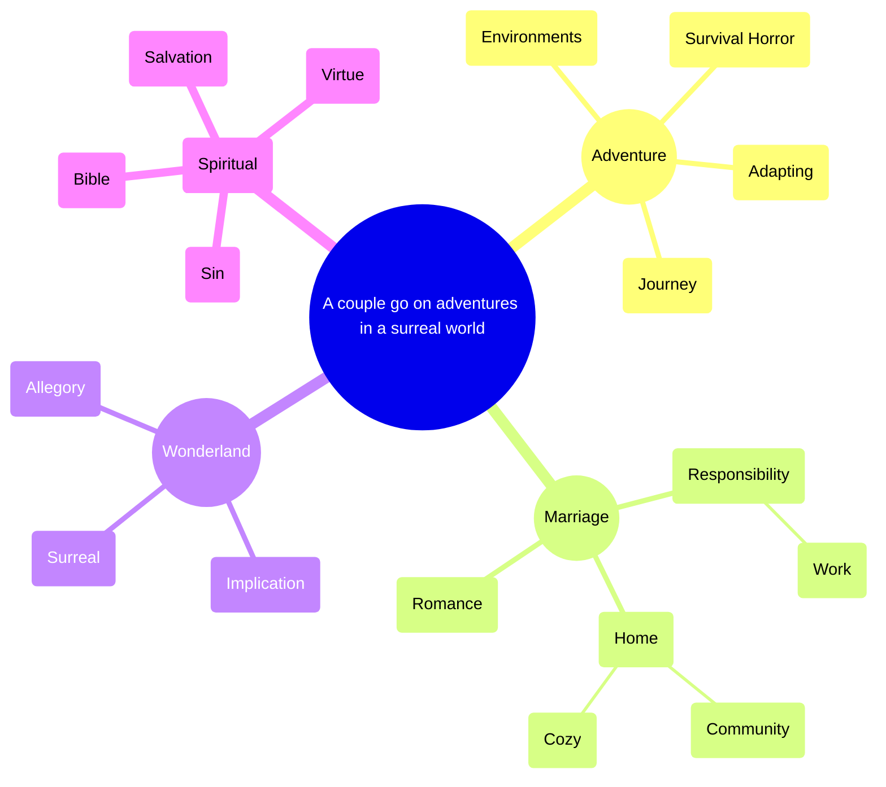

# TWOLD design

# Premise

A husband and wife go on adventures in a surreal world.

# Primary theme

[Peace in the eye of the storm](Features/Peace%20in%20the%20eye%20of%20the%20storm%204e21b1585595437d834a897e603fb87a.md).

# Plot

 

[TWOLD scenes by part](twold-scenes-by-part-151ff4ab3b77406ead435ee39666705c.md) 

# Current focus

[James’ job](Features/James%E2%80%99%20job%201e3a028f3cd8477ba69306ef8654f553.md) 

[Particular James jobs scoping](Features/James%E2%80%99%20job/Particular%20James%20jobs%20scoping%2025b58e628ba280d8a0abd20f0f781b7c.md) 

# Mind map

- [Wonderland](wonderland-3cbc40d2ba2a4c76b4b9dc370452fcfe.md)
    - [Explicit vs. Allegory](explicit-vs-allegory-1d458e628ba2803985e2c08ee8c8f846.md)
    - Implicit
    - [Surreal](Features/Surreal%20cee6644b68094859bf1b17c5e7fd25de.md)
- Spiritual
    - Sin
    - [Depictions of virtue](Features/Depictions%20of%20virtue%20d3f3b663de9446b0aff4183df49926e3.md)
    - Salvation
    - [Biblical](Features/Biblical%20bdacc489959e4e39b8e3a86c7dede268.md)
- [A wholesome marriage is beautiful](Features/A%20wholesome%20marriage%20is%20beautiful%20729f8c8cb3774419a3611b8961a5da02.md)
    - [Responsibility](responsibility-23358e628ba280ca9e79ebeaa0fa931b.md)
        - [James’ job](Features/James%E2%80%99%20job%201e3a028f3cd8477ba69306ef8654f553.md)
    - Romance
    - Home
        - [Cozy](Features/Cozy%2027e58e628ba280a889b9d93e442abcb8.md)
        - [Community](Features/Community%20c80ee480543c42eda65e330b6d1c6d9b.md)
- [Adventure](adventure-1d458e628ba28026830dfe3db74cba19.md)
    - [Free spirited / adaptable main characters](free-spirited-adaptable-main-characters-1d458e628ba2803d9f73cd30fd59b6ef.md)
    - [Survival horror](Features/Survival%20horror%20dc101b6438cf43a8b5f1e17212b8c950.md)
    - Environments
    - [Stability vs. Journey](stability-vs-journey-d03e09bc477b4ef0be148b5e7071d406.md)

# Opposing dimensions

[Untitled](index-1d458e628ba2803e8047c5ce5813ff83-default.md)

# Setting

[TWOLD setting](twold-setting-2a458e628ba280b2a9d4eec45cf051c2.md)

storm