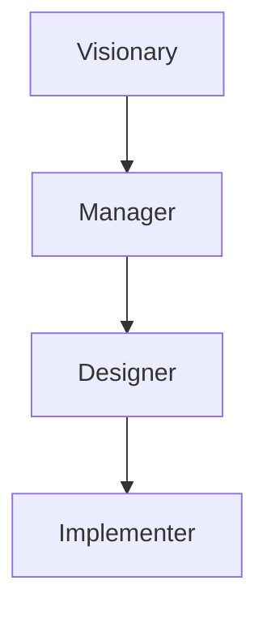

# Creative Roles

When writing a novel, imagine you are four separate people, each with a distinct role.

A single flow of communication passes through the roles.

```mermaid
flowchart TD

Visionary --> Manager
Manager --> Designer
Designer --> Implementer
```

