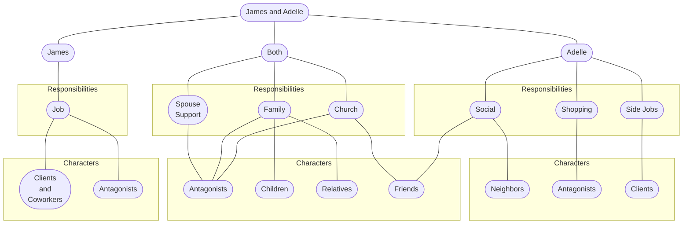
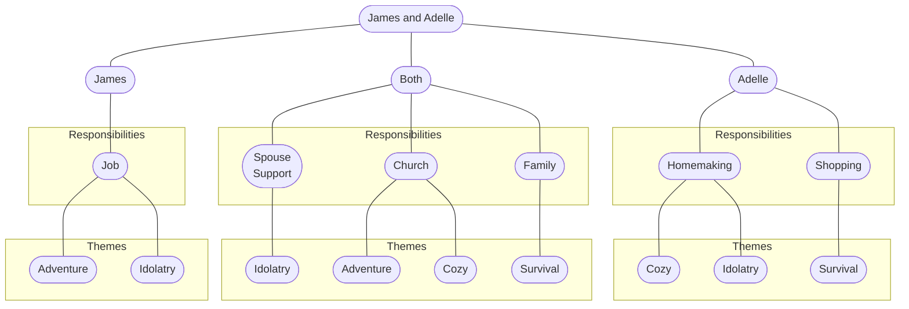
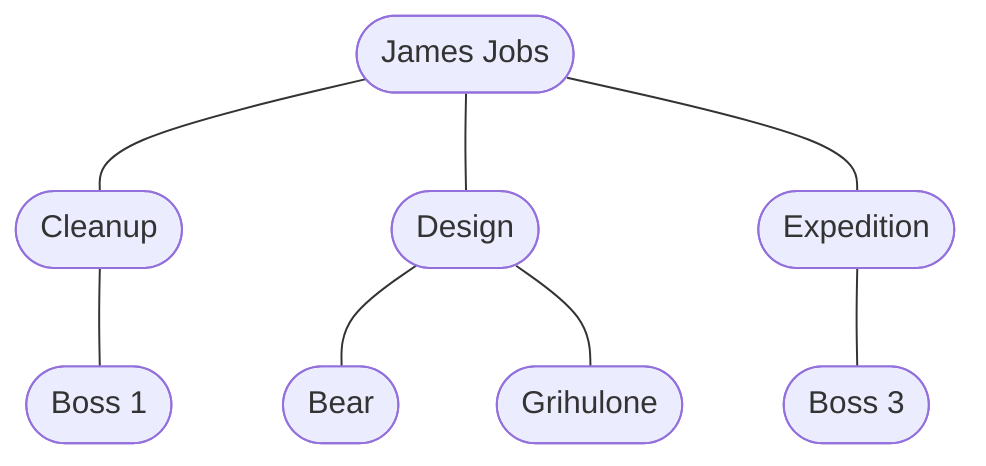

# TWOLD Priority Tree

## Overview

* The purpose of this diagram is to visualize how the story can start from a focal point of the marriage between James and Adelle, and from there branch out into all the other interesting things I want to write about
* These designs play on James being the introvert and Adelle being the extravert
  * In other words: James has a hard time relating to the world outside of his work, while Adelle has a more diverse set of relationships
* With reversed personalities the social aspects of these diagrams would be flipped, though James and Adelle's selected personalities match the average marriage dynamics a little better because women tend to be superior in communal socialization
* Note that these graphs are only highlighting predominant relationships—many more fainter connections could be made between the nodes in these graphs
* There is no special significance whether a node has multiple instances with the same name or not—nodes are split and shared in order to create a clean Mermaid graph (Mermaid's layout system is not nearly as intelligent as other systems such as GraphViz)
* The scope of these diagrams do not extend beyond the couple having infantile children—older children would require more complex children-related graphs, particularly children --> idolatry (children facing their own idolatry)

## Relation to Characters

## Relation to Themes

## James Job Relationships

