# Graph Explorer

## Summary

Interactive, force-directed visualization of the Marloth design graph inside the Marloth editor. Shows records as nodes and relationships as directed links. Uses **precomputed multi-resolution layers** so authors can drill from coarse overview to full detail without overwhelming the canvas at once. Layers are **anchor-centric**: coarse views emphasize records most relevant to the anchor; finer views progressively explode the graph.

## When to read this

Read this doc when your task involves:

- Graph Explorer UI, navigation, or preferences
- LOD layer export (`/api/graph/explorer-lod`)
- Anchor scoping, archive exclusion, branch bundling, relevance scoring
- Changing clustering or zoom-layer behavior

Cross-read: [`marloth-editor.md`](./marloth-editor.md) (editor shell), [`marloth-db.md`](./marloth-db.md) (graph storage), [`../ontology.md`](../ontology.md) (record semantics).

## Requirements

### Scope and data

- Graph Explorer **must** be a distinct editor view (`graph-explorer`), separate from the record page view.
- The graph **must** be derived from active graph vertices and edges in `data/marloth.sqlite` (same export surface as full graph export).
- Records under archived Notion paths (`Marloth/Archive` and descendants) **must** be excluded, along with any edges touching them.
- By default, the graph **must** be scoped to the **connected component** reachable from an **anchor record** via undirected traversal (treat edges as bidirectional for reachability).
- Default anchor **must** be the TWOLD product record (`e028aa0786f5449984a4f497c1d746fa`). Invalid or missing anchor IDs fall back to this default.
- Standalone browser URLs **must** use `?view=explorer&anchor={32-hex-id}`; the `anchor` query param is cleared when leaving Graph Explorer.

### Multi-resolution layers

- The server **must** precompute a fixed stack of **detail layers** (coarsest → finest); default depth is **3**, configurable in Settings (2–10).
- Layer subdivision **must** be **anchor-centric**: coarse layers show the anchor plus the highest-relevance records; non-promoted records **must** bundle under branch clusters tied to a promoted gateway.
- The finest layer **must** show one node per individual record with unaggregated edges.
- Each coarser layer **must** have no more visible nodes than the next finer layer (monotonic non-decreasing node counts).
- Cluster nodes **must** be visually distinguishable (warm amber color; size reflects member count; labels show the gateway title only). They **must not** be openable as records.
- Individual record nodes **must** use cool-toned colors by record type (`group`); on aggregated layers the toolbar **should** show a compact Record / Cluster legend.
- Individual record nodes (32-character hex IDs, non-cluster) **must** be openable: click → same tab; Ctrl/Cmd/middle-click → new tab (same navigation semantics as record links elsewhere in the editor).

### Interaction

- Initial view **should** start at the **coarsest layer** for overview-first drill-down.
- **Click cluster nodes** on aggregated layers **must** advance to the next finer layer (drill down) in Layers mode.
- Toolbar **must** provide a control to return to a coarser layer when not on layer 1 (Layers mode only).
- Toolbar **must** show current layer label (`Layer N/M`), node/link counts, and a **Settings** dropdown. All explorer preferences **must** live in Settings—not in the top bar.
- Settings dropdown **must** include:
  - **Show labels** — persist canvas node labels (`localStorage` key `marloth.graph.showNodeLabels`).
  - **Show relevance diagnostics** — enrich node hover tooltips with relevance key/value lines (`localStorage` key `marloth.graph.showRelevanceDiagnostics`).
  - **Explorer mode** — `layers` (default) or `relative` (`localStorage` key `marloth.graph.explorerMode`):
    - **Layers** — precomputed LOD layers; click clusters to drill down within the same anchor; **← Out** returns to a coarser layer.
    - **Relative** — shows the configured detail layer (default layer 2 of N) for the current anchor; click clusters to **re-anchor** the graph to that cluster's gateway record; **← Back** returns to the previous anchor when navigation history exists.
  - **Layer depth** — number of LOD layers to precompute (default **3**, range 2–10; `localStorage` key `marloth.graph.layerDepth`). Changing depth refetches the graph.
  - **Relative detail** — which precomputed layer Relative mode displays (1 = coarsest … N = finest; default **2**; `localStorage` key `marloth.graph.relativeDetail`). Clamped to layer depth.
- All graph settings **must** persist in browser `localStorage` (global across Graph Explorer views, not the git-tracked user settings file).
- With diagnostics enabled, hovering a **record node** **must** show a multiline tooltip: title plus `key: value` lines for score components; hovering a **cluster node** **must** show bundle summary (`members`, `gateway`, `layer`).
- Aggregated layers **should** show combined link weights (edge label + count) and thicker links proportional to weight.

### API

- `GET /api/graph/explorer-lod?anchor={optional}&layers={optional}` **must** return `{ graph: { layerCount, levels[] } }` where each level is `{ nodes[], links[] }`. `layers` defaults to **3** when omitted.
- Record nodes carry: id, title, path, labels, optional group (primary label), optional `relevance` diagnostics.
- Cluster nodes carry: id, title, labels, `isCluster`, member count (`val`), optional `bundle` diagnostics.
- Links carry: id, source, target, label; optional weight on aggregated layers.

#### `GraphNodeRelevance` (record nodes)

| Field | Meaning |
| --- | --- |
| `score` | Total relevance score |
| `hop` | Shortest-path hops from anchor |
| `degree` | Incident edge count in scoped graph |
| `directNeighbor` | Linked directly to anchor |
| `hopContribution` | Proximity component of score |
| `degreeContribution` | Hub component of score |
| `directBonus` | Direct-neighbor bonus component |
| `rank` | 1-based rank among all nodes (anchor = 1) |
| `promoted` | Individually visible at this layer |

#### `GraphNodeBundle` (cluster nodes)

| Field | Meaning |
| --- | --- |
| `memberCount` | Records in the branch bundle |
| `gatewayId` | Promoted gateway record id |
| `gatewayTitle` | Gateway record title |
| `layer` / `layerCount` | Current layer index (1-based) and total layers |

## Design rationale

- **Why layers:** The full design graph is too dense for a single force layout; pre-aggregated levels give a navigable overview that explicit drill-down can refine.
- **Why anchor scoping:** Authors care about the subgraph connected to a product/book root (TWOLD), not every disconnected stub in the corpus.
- **Why anchor-centric promotion:** Coarse views should read as “what matters from here,” not arbitrary global density clusters.
- **Why server-side layering:** Layers are computed once per request from graph export data, keeping the webview simple and ensuring consistent snapshots across clients.
- **Why relevance diagnostics:** Debugging promotion decisions should not require reading implementation code.

## Behavior / pipeline

```
Active vertices and edges
  → exclude Marloth/Archive records and touching edges
  → keep anchor connected component (undirected reachability)
  → score relevance from anchor (hop + hub degree + direct-neighbor bonus)
  → promote top-ranked nodes per layer; bundle remainder by branch gateway
  → build N graph snapshots (N = layer depth)
  → GET /api/graph/explorer-lod
  → webview selects layer via cluster click / toolbar
  → force-directed 2D canvas
```



```mermaid
flowchart LR
  subgraph db [Graph export]
    Active["Active vertices and edges"]
    ArchiveFilter["Exclude Marloth/Archive"]
    AnchorFilter["Keep anchor connected component"]
  end
  subgraph lod [Layer subdivision]
    Relevance["Score relevance from anchor"]
    Promote["Promote top nodes per layer"]
    Bundle["Bundle rest by branch gateway"]
    Snapshots["Build N graph snapshots"]
  end
  subgraph ui [Editor webview]
    Fetch["GET /api/graph/explorer-lod"]
    Navigate["Click clusters / toolbar to change layer"]
    Render["Force-directed 2D canvas"]
  end
  Active --> ArchiveFilter --> AnchorFilter --> Relevance --> Promote --> Bundle --> Snapshots --> Fetch --> Navigate --> Render
```

## Layer subdivision algorithm

The following describes how the server subdivides the scoped graph into detail layers. This section is code-independent.

1. **Start from the scoped graph.** Take all non-archived records and relationships in the anchor’s connected component.

2. **Measure distance from anchor.** Treat relationships as undirected for reachability. Record hop distance from anchor to each node (anchor = 0).

3. **Score relevance** for every node using a weighted combination:
   - **Proximity:** closer nodes score higher (inverse of hop distance).
   - **Hub strength:** nodes with more incident relationships score higher (log-scaled).
   - **Direct-link bonus:** immediate neighbors of the anchor get an extra boost.
   - The anchor always ranks first and is always visible at every layer.

4. **Choose per-layer visibility budgets.** N layers interpolate from a small coarse budget (roughly cube root of N, minimum 3) up to N (everyone individual). Budgets are strictly non-decreasing.

5. **Promote nodes layer by layer.** At each layer, the individually visible nodes are the top-ranked nodes up to that layer’s budget. Finer layers are supersets of coarser layers (true drill-down).

6. **Bundle the rest by branch.** Every non-promoted node is assigned to a bundle tied to the **nearest promoted gateway** on its path back toward the anchor (walk up the breadth-first tree from anchor). If that gateway also has bundled descendants, the gateway is **included in its own branch cluster** so the graph never shows the same record as both an individual node and a cluster with the same name. Each bundle becomes one cluster node, named after its gateway, with member count shown. Links between bundles and promoted nodes are aggregated.

7. **Finest layer:** all records individual, all edges unaggregated; relevance metadata still attached.

8. **Display layer selection (client).** The UI selects among the precomputed snapshots via cluster clicks (drill down) and a toolbar control (drill up). Canvas zoom is for panning and magnification only.

## Inputs / outputs / artifacts

| Artifact | Role |
| --- | --- |
| `GET /api/graph/explorer-lod` | LOD graph payload |
| `?view=explorer&anchor=` | Standalone deep link |
| `localStorage` `marloth.graph.showNodeLabels` | Show canvas labels |
| `localStorage` `marloth.graph.showRelevanceDiagnostics` | Show relevance hover diagnostics |
| `localStorage` `marloth.graph.explorerMode` | Explorer mode (`layers` or `relative`) |
| `localStorage` `marloth.graph.layerDepth` | LOD layer count (2–10, default 3) |
| `localStorage` `marloth.graph.relativeDetail` | Relative mode detail layer (1–N, default 2) |

## Quick start

1. Start the editor (`bun run editor:dev` or attach to the devcontainer).
2. Open the Marloth editor in the browser or VS Code webview.
3. Click **Graph Explorer** in the sidebar (⊕).
4. Use **Settings** for explorer mode, layer depth, labels, and diagnostics; click cluster nodes to drill down (Layers) or re-anchor (Relative); use **← Out** / **← Back** as appropriate; click individual record nodes on the finest layer to open them.

## Configuration

| Setting | Default |
| --- | --- |
| Layer depth | 3 (range 2–10, Settings) |
| Relative detail | 2 (layer 2 of N, Settings) |
| Explorer mode | Layers |
| Default anchor | TWOLD product record (`e028aa0786f5449984a4f497c1d746fa`) |
| Initial layer | Coarsest (layer 1 of N) |
| Hop / degree / direct-neighbor weights | 1.0 / 0.35 / 0.5 (server-side constants) |

## Verification

- `bun test packages/marloth-db/src/graph-export.test.ts` — archive exclusion, LOD layers, anchor filtering
- `bun test packages/marloth-db/src/graph-lod-cluster.test.ts` — anchor visibility, relevance ranking, branch bundling
- `bun test packages/marloth-editor/src/webview/graph-lod.test.ts` — layer navigation, openable nodes
- `bun test packages/marloth-editor/src/webview/graph-preferences.test.ts` — settings persistence
- `bun test packages/marloth-editor/src/webview/graph-node-label.test.ts` — hover diagnostic formatting
- Manual: open Graph Explorer → coarse layer shows anchor-centric view → click clusters to reveal more nodes → diagnostics toggle shows score breakdown on hover

## Implementation pointers

| Module | Responsibility |
| --- | --- |
| `packages/marloth-db/src/graph-export.ts` | Export entry, anchor BFS, archive filter, node types |
| `packages/marloth-db/src/graph-lod-cluster.ts` | Anchor-centric layer subdivision + relevance metadata |
| `packages/marloth-editor/src/api/server.ts` | `/api/graph/explorer-lod` route |
| `packages/marloth-editor/src/webview/components/GraphView.tsx` | Force graph UI + settings dropdown |
| `packages/marloth-editor/src/webview/graph-lod.ts` | Layer navigation helpers |
| `packages/marloth-editor/src/webview/graph-node-label.ts` | Hover label formatting |
| `packages/marloth-editor/src/webview/graph-preferences.ts` | localStorage settings |

## See also

- [marloth-editor.md](./marloth-editor.md)
- [marloth-db.md](./marloth-db.md)
- [`../ontology.md`](../ontology.md)
- [`packages/marloth-editor/AGENTS.md`](../../packages/marloth-editor/AGENTS.md)
- [`packages/marloth-db/AGENTS.md`](../../packages/marloth-db/AGENTS.md)
