# Graph Explorer

## Summary

Interactive, force-directed visualization of the Marloth design graph inside the Marloth editor. Shows records as nodes and relationships as directed links. Uses **precomputed multi-resolution layers** so zooming in reveals finer detail without overwhelming the user at full-graph scale.

## When to read this

Read this doc when your task involves:

- Graph Explorer UI, navigation, or preferences
- LOD layer export (`/api/graph/explorer-lod`)
- Anchor scoping, archive exclusion, cluster aggregation
- Changing clustering or zoom-layer behavior

Cross-read: [`marloth-editor.md`](./marloth-editor.md) (editor shell), [`marloth-db.md`](./marloth-db.md) (graph storage), [`../ontology.md`](../ontology.md) (record semantics).

## Requirements

### Scope and data

- Graph Explorer **must** be a distinct editor view (`graph-explorer`), separate from the record page view.
- The graph **must** be derived from active graph vertices and edges in `data/marloth.sqlite` (same export surface as full graph export).
- Records under archived Notion paths (`Marloth/Archive` and descendants) **must** be excluded, along with any edges touching them.
- By default, the graph **must** be scoped to the **connected component** reachable from an **anchor record** via undirected traversal (treat edges as bidirectional for reachability).
- Default anchor **must** be the TWOLD product record (`e028aa0786f5449984a4f497c1d746fa`). Invalid or missing anchor IDs fall back to this default.
- Standalone browser URLs **must** use `?view=explorer&anchor={32-hex-id}`; the `anchor` query param is cleared when leaving Graph Explorer.

### Multi-resolution layers

- The server **must** precompute a fixed stack of **5 detail layers** (coarsest → finest).
- Layer 1 (index 0) **must** show aggregated **clusters**; the finest layer **must** show one node per individual record with unaggregated edges.
- Each coarser layer **must** have no more visible nodes than the next finer layer (monotonic non-decreasing node counts).
- Cluster nodes **must** be visually distinguishable (size reflects member count; labels show count). They **must not** be openable as records.
- Individual record nodes (32-character hex IDs, non-cluster) **must** be openable: click → same tab; Ctrl/Cmd/middle-click → new tab (same navigation semantics as record links elsewhere in the editor).

### Interaction

- Initial view **should** start at the **middle layer** (layer 3 of 5) for a balanced overview.
- Zoom in/out **must** switch among precomputed layers; layer changes **should** use **hysteresis** so rapid zoom does not flicker between adjacent layers.
- Toolbar **must** show current layer label (`Layer N/5`), node/link counts, and a “Show labels” toggle.
- “Show labels” preference **must** persist in browser `localStorage` (not the git-tracked user settings file).
- Aggregated layers **should** show combined link weights (edge label + count) and thicker links proportional to weight.

### API

- `GET /api/graph/explorer-lod?anchor={optional}` **must** return `{ graph: { layerCount, levels[] } }` where each level is `{ nodes[], links[] }`.
- Nodes carry: id, title, path, labels, optional group (primary label), optional cluster flag and member count.
- Links carry: id, source, target, label; optional weight on aggregated layers.

## Design rationale

- **Why layers:** The full design graph is too dense for a single force layout; pre-aggregated levels give a navigable overview that zoom can refine.
- **Why anchor scoping:** Authors care about the subgraph connected to a product/book root (TWOLD), not every disconnected stub in the corpus.
- **Why server-side clustering:** Layers are computed once per request from graph export data, keeping the webview simple and ensuring consistent snapshots across clients.
- **Why edge-weighted merging:** Clusters should reflect actual relationship density in the design graph, not arbitrary partitioning.

## Behavior / pipeline

```
Active vertices and edges
  → exclude Marloth/Archive records and touching edges
  → keep anchor connected component (undirected reachability)
  → compute target cluster counts per layer
  → bottom-up greedy cluster merging
  → build 5 graph snapshots
  → GET /api/graph/explorer-lod
  → webview maps zoom to layer (with hysteresis)
  → force-directed 2D canvas
```



```mermaid
flowchart LR
  subgraph db [Graph export]
    Active["Active vertices and edges"]
    ArchiveFilter["Exclude Marloth/Archive"]
    AnchorFilter["Keep anchor connected component"]
  end
  subgraph lod [Layer subdivision]
    Targets["Compute target cluster counts per layer"]
    Merge["Bottom-up greedy cluster merging"]
    Snapshots["Build 5 graph snapshots"]
  end
  subgraph ui [Editor webview]
    Fetch["GET /api/graph/explorer-lod"]
    Zoom["Map zoom to layer with hysteresis"]
    Render["Force-directed 2D canvas"]
  end
  Active --> ArchiveFilter --> AnchorFilter --> Targets --> Merge --> Snapshots --> Fetch --> Zoom --> Render
```

## Layer subdivision algorithm

The following describes how the server subdivides the scoped graph into five detail layers. This section is code-independent.

1. **Start from the scoped graph.** Take all non-archived records and relationships in the anchor’s connected component.

2. **Choose five target sizes.** For a graph with N records, assign each of the five layers a target number of visible groups, growing from very coarse to fully detailed:
   - The coarsest layer targets roughly the cube root of N (but at least 2 groups).
   - Intermediate layers interpolate exponentially between that coarse target and N.
   - The finest layer always targets N — one group per record.
   - Targets never decrease as you move from coarse to fine.

3. **Begin at full detail.** The finest layer is the raw graph: every record is its own group.

4. **Build coarser layers by merging.** Working from fine to coarse, repeatedly merge pairs of groups until the current group count matches that layer’s target:
   - **Which pair to merge:** Prefer the two groups that share the **most relationship edges** between them (counting parallel edges). If several pairs tie, pick deterministically (stable ordering). If no edges cross group boundaries, merge the two lexicographically smallest group IDs as a fallback.
   - **Which group survives a merge:** Keep the group whose representative record has the **higher number of incident edges**; ties break deterministically.
   - **Snapshot:** After reaching the target count, save the grouping as that layer’s partition.

5. **Turn each partition into a visible graph.**
   - **Groups with one member** appear as ordinary record nodes.
   - **Groups with multiple members** appear as cluster nodes named after a representative record, sized by member count, and marked as non-openable clusters.
   - **On coarse layers:** Combine all edges between groups into single links; link weight equals the number of underlying relationships with the same label. Drop within-group edges.
   - **On the finest layer:** Show every original relationship unchanged.

6. **Display layer selection (client).** The UI does not recompute layers; it selects among the five precomputed snapshots based on zoom level, with hysteresis at layer boundaries so zooming does not oscillate.

## Inputs / outputs / artifacts

| Artifact | Role |
| --- | --- |
| `GET /api/graph/explorer-lod` | LOD graph payload |
| `?view=explorer&anchor=` | Standalone deep link |
| Browser `localStorage` key `marloth.graph.showNodeLabels` | Label toggle |

## Quick start

1. Start the editor (`bun run editor:dev` or attach to the devcontainer).
2. Open the Marloth editor in the browser or VS Code webview.
3. Click **Graph Explorer** in the sidebar (⊕).
4. Zoom in/out to change detail level; click individual record nodes on the finest layer to open them.

## Configuration

| Setting | Default |
| --- | --- |
| Layer count | 5 |
| Default anchor | TWOLD product record (`e028aa0786f5449984a4f497c1d746fa`) |
| Initial layer | Middle layer (3 of 5) |

## Verification

- `bun test packages/marloth-db/src/graph-export.test.ts` — archive exclusion, 5 layers, anchor filtering
- `bun test packages/marloth-db/src/graph-lod-cluster.test.ts` — monotonic counts, clustering
- `bun test packages/marloth-editor/src/webview/graph-lod.test.ts` — zoom hysteresis, openable nodes
- Manual: open Graph Explorer from sidebar → zoom changes layer label → finest layer nodes open records → archived records absent

## Implementation pointers

| Module | Responsibility |
| --- | --- |
| `packages/marloth-db/src/graph-export.ts` | Export entry, anchor BFS, archive filter |
| `packages/marloth-db/src/graph-lod-cluster.ts` | Layer subdivision algorithm |
| `packages/marloth-editor/src/api/server.ts` | `/api/graph/explorer-lod` route |
| `packages/marloth-editor/src/webview/components/GraphView.tsx` | Force graph UI |
| `packages/marloth-editor/src/webview/graph-lod.ts` | Zoom → layer mapping |

## See also

- [marloth-editor.md](./marloth-editor.md)
- [marloth-db.md](./marloth-db.md)
- [`../ontology.md`](../ontology.md)
- [`packages/marloth-editor/AGENTS.md`](../../packages/marloth-editor/AGENTS.md)
- [`packages/marloth-db/AGENTS.md`](../../packages/marloth-db/AGENTS.md)
