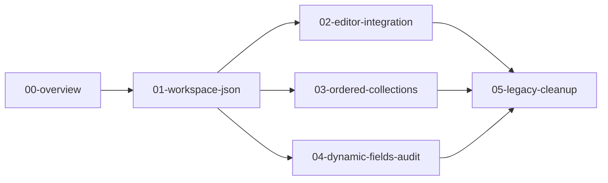

# Marloth → Tome refactor — overview

## Goal

**Tome packages** (`tome-db`, `tome-editor`, `tome-static-site`) should stay **domain-agnostic**. Marloth-specific node IDs, navigation, archive rules, and export-path assumptions belong in **`content/model/`** as git-tracked workspace configuration—not as hardcoded constants in TypeScript.

This directory holds **session guides** for that migration. Each numbered doc is scoped to one PR-sized chunk of work an agent can pick up independently.

## Session guides

| Session | Doc | Depends on | Primary packages |
| --- | --- | --- | --- |
| 1 | [01-workspace-json.md](./01-workspace-json.md) | — | `tome-db`, `tome-static-site` |
| 2 | [02-editor-workspace-integration.md](./02-editor-workspace-integration.md) | 01 | `tome-editor` |
| 3 | [03-ordered-collections-json.md](./03-ordered-collections-json.md) | 01 | `tome-db`, `tome-editor` |
| 4 | [04-dynamic-fields-and-audit.md](./04-dynamic-fields-and-audit.md) | 01 | `tome-db`, `scripts/` |
| 5 | [05-legacy-compat-and-cleanup.md](./05-legacy-compat-and-cleanup.md) | 02–04 (incremental OK) | all packages, docs |

**Recommended order:** read this file → session 01 → session 02; sessions 03 and 04 can run in parallel after 01 → session 05 last.



## Already in `content/model/` (do not duplicate in code)

Domain-specific **data** already lives in the workspace model. Do not re-embed these IDs or rules in package source.

| File | Role |
| --- | --- |
| [`content/model/schema.json`](../content/model/schema.json) | Relationship rules (`relationshipRules`), property enums (`priority`, `layer`, …) |
| [`content/model/table-schemas.json`](../content/model/table-schemas.json) | Per–type-table column definitions |
| [`content/model/views.json`](../content/model/views.json) | Table tab configs; Scenes DB references ordered-association provider `scenes-by-book` only |
| [`content/model/dynamic-fields.json`](../content/model/dynamic-fields.json) | Computed column bindings and resolver params |
| [`content/model/associations.json`](../content/model/associations.json) | Composite relationship type registry |

## Still hardcoded in packages (inventory)

### Tier 1 — workspace identity (sessions 01–02)

| Concern | Current location | Target |
| --- | --- | --- |
| Home node id | `packages/tome-db/src/queries.ts` (`DEFAULT_HOME_NODE_ID`); duplicate in `tome-editor/src/shared/types.ts` | `workspace.json` → `homeNodeId` |
| Archive hub id | `packages/tome-db/src/archive-status.ts` | `workspace.json` → `archiveNodeId` |
| Protected nodes | `packages/tome-db/src/node-lifecycle.ts` | `workspace.json` → `protectedNodeIds` |
| Graph Explorer default anchor | `packages/tome-db/src/graph-export.ts`; duplicate in `tome-editor/src/shared/graph-explorer.ts` | `workspace.json` → `graphExplorer.defaultAnchorNodeId` |
| Static site home | `packages/tome-static-site/src/generate-data.ts` (`STATIC_SITE_HOME_NODE_ID`) | `workspace.json` → `staticSite.homeNodeId` |
| Quick links | `packages/tome-editor/src/webview/quick-links-nav.ts` | `workspace.json` → `quickLinks` |
| Default document icon | `packages/tome-editor/src/webview/document-icon.ts` (`DEFAULT_ICON = "M"`) | `workspace.json` → `branding.defaultDocumentIcon` |
| Legacy archive export path | `packages/tome-db/src/archive-status.ts` (legacy archive path prefix `"Marloth/Archive"`) | `workspace.json` → `legacy.archivePathPrefix` |

Current Marloth values (for seeding `workspace.json` in session 01):

| Key | Node id / value |
| --- | --- |
| Home (editor) | `13458e628ba28073850dea0edb9acde1` |
| Archive hub | `0f558a609a56485185beed4d1fd1cd9f` |
| Graph anchor (TWOLD product) | `e028aa0786f5449984a4f497c1d746fa` |
| Static site home | `5bfc10918fa24207879d68a030927dd3` |

### Tier 2 — domain feature config in code (sessions 03–04)

| Concern | Current location | Target |
| --- | --- | --- |
| Ordered associations (`scenes-by-book`) | `packages/tome-db/src/ordered-collections.ts` (`SCENES_BY_BOOK`, `CONFIGS`) | `content/model/ordered-collections.json` |
| Dynamic resolver composite fallbacks | `packages/tome-db/src/dynamic-fields/resolvers/index.ts` | Params in `dynamic-fields.json` |
| Type membership audit path rules | `scripts/lib/type-membership-audit.ts` (`Marloth/` prefix) | `workspace.json` → `legacy.exportPathPrefix` |

### Tier 3 — legacy compatibility (session 05)

Keep **read** support; deprecate names over time. Do not remove without a migration note.

| Surface | Location |
| --- | --- |
| `marloth:` / `marloth://node/` link schemes | `packages/tome-db/src/markdown-links.ts`, `tome-editor/src/shared/types.ts` |
| `MARLOTH_*` env fallbacks | `tome-db`, `tome-editor`, `tome-static-site` paths/config |
| `marloth.sqlite`, `.marloth/user-settings.json` | `packages/tome-db/src/content/paths.ts`, `tome-editor/src/api/paths.ts` |
| Graph Explorer `localStorage` keys | `packages/tome-editor/src/webview/graph-preferences.ts` (`marloth.graph.*`) |
| Deprecated type aliases | `MarlothWriteContext`, `marlothHref`, etc. |

## Conventions for all sessions

1. **Model loaders** — Follow existing patterns in [`packages/tome-db/src/schema-rules/load.ts`](../../packages/tome-db/src/schema-rules/load.ts) and [`packages/tome-db/src/views/load.ts`](../../packages/tome-db/src/views/load.ts): mtime-based cache, `invalidate*Cache()`, parse with validation, sensible empty defaults only where safe.
2. **Paths** — Add filename constants and `*FilePath()` helpers to [`packages/tome-db/src/content/paths.ts`](../../packages/tome-db/src/content/paths.ts).
3. **Exports** — Re-export new loaders/types from [`packages/tome-db/src/index.ts`](../../packages/tome-db/src/index.ts) when other packages need them.
4. **Tests** — Use `createTestContentFixture` from `tome-db` test helpers; write model JSON into the fixture content dir.
5. **Feature docs** — Update [`docs/features/tome-editor.md`](../features/tome-editor.md) and [`docs/features/tome-db.md`](../features/tome-db.md) when behavior or model files change.
6. **Graph workflow** — Edit `content/` only; never commit `data/tome.sqlite`. Run `bun test` before finishing a session.

## Known doc bug (fix in session 02)

[`docs/features/tome-editor.md`](../features/tome-editor.md) cites home node `72b6fb455b824b78962b0e509cc091c9`. Runtime uses `13458e628ba28073850dea0edb9acde1` (`DEFAULT_HOME_NODE_ID` in `queries.ts`). The older id still resolves via legacy export path suffix matching in link resolution.

## Global completion checklist

Use this when the full refactor series is done:

- [x] `content/model/workspace.json` exists and is loaded by `tome-db`
- [x] No duplicate home/archive/anchor IDs in `tome-editor` source (only via workspace/API)
- [x] Sidebar links come from workspace config, not hardcoded `sidebar-nav.ts` array
- [x] `content/model/ordered-collections.json` drives ordered-association configs
- [x] Static site home reads from workspace config
- [x] Dynamic resolvers use params only (no unparameterized composite type strings)
- [x] Type membership audit uses configurable export path prefix
- [x] Root [`AGENTS.md`](../../AGENTS.md) links this overview
- [x] `bun test` passes

## Out of scope

- Rewriting [`content/model/schema.json`](../content/model/schema.json) enums/rules to be domain-neutral (node IDs in content are fine).
- Weighted relationship properties (future ontology work).

## Verification commands

```bash
bun test
# After session 04:
# bun run scripts/check-type-membership.ts
```
